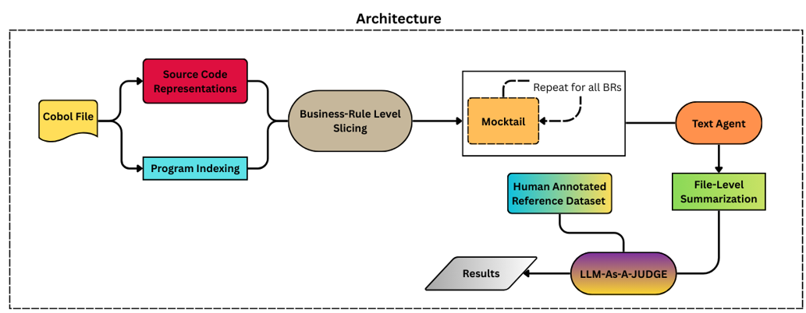
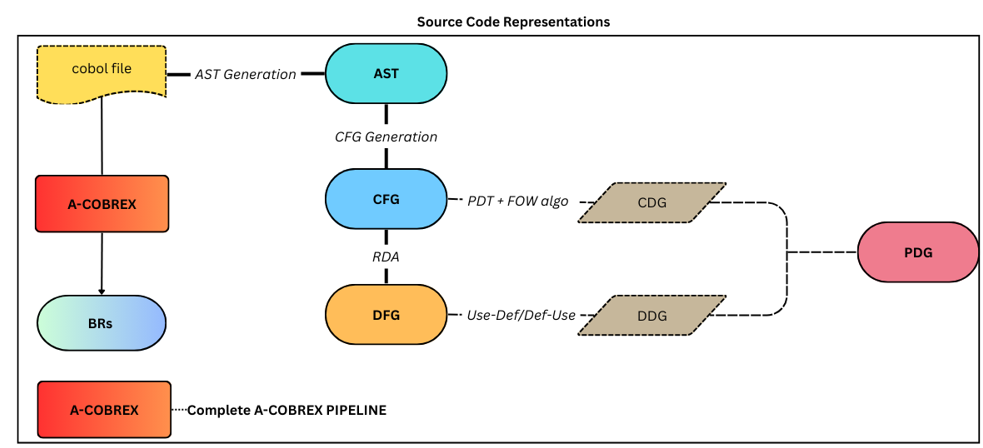
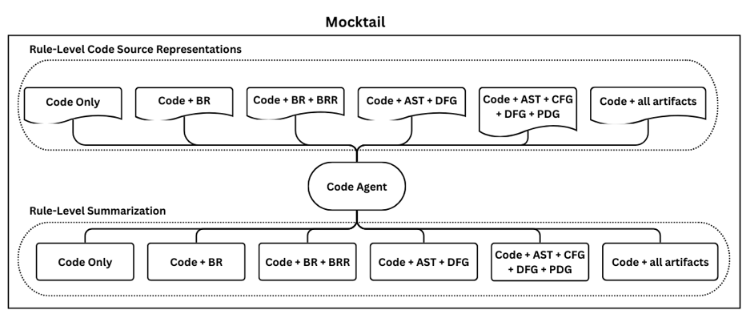

# MOCKTAIL-BASED MULTI-VIEW COBOL PROGRAM SUMMARIZATION USING BUSINESS RULES AND MULTI-AGENT LLM

This repository contains the official implementation of our **Mocktail-Based Multi-View COBOL Program Summarization** framework.  
The system integrates:

- **Static Program Analysis** (AST, CFG, DFG, PDG)
- **Business Rule Extraction (BR)**
- **Business Rule Realisation (BRR / Activation Graph)**
- **Realised Basic Blocks (RBBs)**
- **Multi-View Mocktail Prompting Strategy**
- **Multi-Agent LLM Pipeline**  
  (Code Processing Agent → Text Processing Agent → LLM-as-a-Judge)

The project aims to generate **high-quality rule-level and program-level summaries** for large legacy COBOL systems using both **structured program analysis** and **adaptive large language models (LLMs)**.

Repository link:  
➡️ **https://github.com/cs24m111/mtp-cobol-mocktail-summarization**

---

## 📘 Table of Contents

1. [Introduction](#introduction)
2. [System Architecture](#system-architecture)
3. [Repository Structure](#repository-structure)
4. [Installation & Setup](#installation--setup)
5. [Static Pipeline (Single COBOL Program)](#static-pipeline-single-cobol-program)
6. [DFG + PDG Builder](#dfg--pdg-builder)
7. [Mocktail Prompt Generation](#mocktail-prompt-generation)
8. [LLM Multi-Agent Pipeline](#llm-multi-agent-pipeline)
9. [LLM-as-a-Judge Evaluation](#llm-as-a-judge-evaluation)
10. [Running on All Projects (Full Dataset)](#running-on-all-projects-full-dataset)
11. [Reproducibility Steps](#reproducibility-steps)


---

## Introduction

Legacy COBOL systems are extremely large and critical, yet difficult to understand due to:

- Cross-file procedural interactions  
- Complex business logic  
- Data dependencies  
- Non-modular structure  
- Lack of updated documentation  

This project proposes a **multi-view summarization framework** that augments LLMs with **business rules**, **control/data-flow graphs**, and **program structural abstractions**.  

The pipeline integrates:

- *Static analysis → Business rule extraction → Multi-view prompt construction → Multi-agent summarization → Evaluation*

All experiments can be run:

# Per COBOL Program  
# Across full COBOL projects (batch mode)

---

## 🏗 System Architecture

Architecture Diagram of our Project


Source code generation in detail explained in this fig



After generating different code source representations,taking combinations of them as mocktail and giving to code agent LLM for each Business rule and getting summarization is given here in thuis fig


The major modules are:

### 1. **Static Analysis**
- Preprocessing  
- AST generation  
- Control Flow Graph (CFG)  
- Data Flow Graph (DFG)  
- Program Dependence Graph (PDG)

### 2. **Business Logic Extraction**
- Business Rule Extraction (BR)  
- Business Rule Realisation (BRR / Activation Graph)  
- Realised Basic Blocks (RBBs)

### 3. **Mocktail Multi-View Prompt Builder**
6 modes:
- C  
- C+BR  
- C+BR+BRR  
- C+AST+DFG  
- C+AST+CFG+DFG+PDG  
- FULL (all)

### 4. **Multi-Agent LLM Pipeline**
- **Code Processing Agent** → rule-level summarization  
- **Text Processing Agent** → program-level summarization  
- **Judge LLM** → scoring summaries vs human-written references

### 5. **Evaluation**
- Multi-criteria judgment (purpose, functionality, clarity)  
- Per-file and per-project CSV generation  

---

## 📂 Repository Structure

```

mtp-cobol-mocktail-summarization/
│
├── extractor.py                     # Single-file static extractor (AST, CFG, BR, BRR, RBB)
├── preprocessor.py                  # COBOL preprocessing
├── run_all_projects_static.py       # Static pipeline for full dataset
├── mtp_llm_pipeline.py              # LLM pipeline (rule + file + judge)
├── mtp_full_pipeline_all_projects.py# End-to-end multi-project pipeline
│
├── summarizer/
│   ├── build_br_json_from_dot.py
│   ├── program_index.py
│   ├── br_representation.py
│   └── run_summarization.py         # Mocktail prompt generator
│
├── DFG/                             # Data-flow graph builder
├── PDG/                             # Program dependence graph builder
├── RBB/                             # Realised Basic Block builder
├── BR_Realisation/                  # Business rule activation graph
│
├── Benchmarksuite/                  # Sample COBOL programs
├── data/                            # Human references + cleaned datasets
├── output/                          # Auto-generated static + LLM results
│
├── requirements.txt
└── README.md

````

---

## Installation & Setup

### 1. Clone repository

```bash
git clone https://github.com/cs24m111/mtp-cobol-mocktail-summarization.git
cd mtp-cobol-mocktail-summarization
````

### 2. Python dependencies

```bash
pip install -r requirements.txt
```

### 3. External dependencies

| Tool                 | Purpose                           |
| -------------------- | --------------------------------- |
| **Graphviz**         | Render CFG/DFG/PDG PDFs           |
| **Proleap/GnuCOBOL** | COBOL preprocessing               |
| **Ollama**           | Local LLMs (Llama 3.1, CodeLlama) |

---

## 🧩 Static Pipeline (Single COBOL Program)

Run:

```bash
python extractor.py path/to/PROGRAM.cbl
```

### extractor.py Performs:

1. Preprocessing
2. AST generation
3. CFG creation
4. Business Rule extraction
5. BRR / Activation Graph generation
6. Realised Basic Blocks extraction

Generated assets appear under:

```
output/PROGRAM/
  CFG/
  Rules/
  RBBs/
  BRR_PROGRAM.pdf
  clean_output.cbl
```

---

## 🔁 DFG + PDG Builder

Code for building DFG and PDG is located in:

```
DFG/
PDG/
```

You can integrate them with extractor outputs or run builders separately depending on your environment.

---

## Mocktail Prompt Generation

Run (internally handled by summarizer module):

```bash
python -m summarizer.run_summarization \
  --base-dir output/PROGRAM \
  --prog PROGRAM
```

Prompts stored under:

```
output/PROGRAM/BR_PROMPTS/<mode>/
```

---

## LLM Multi-Agent Pipeline

### Rule-Level Summaries

```bash
python mtp_llm_pipeline.py \
  --prog PROGRAM \
  --base-dir output/PROGRAM \
  rule --code-model codellama
```

### File-Level Summary

```bash
python mtp_llm_pipeline.py \
  --prog PROGRAM \
  --base-dir output/PROGRAM \
  file --text-model llama3.1
```

### Outputs:

```
output/PROGRAM/LLM/rule_level/
output/PROGRAM/LLM/file_level/
```

---

## LLM-as-a-Judge Evaluation

```bash
python mtp_llm_pipeline.py \
  --prog PROGRAM \
  --base-dir output/PROGRAM \
  judge \
  --reference data/human_references/PROGRAM.txt \
  --judge-model llama3.1
```

Produces:

```
eval_PROGRAM.json
```

---

## Running on All Projects (Full Dataset)

### 1. Generate static artifacts for all `.cbl` files:

```bash
python run_all_projects_static.py \
  --projects-root data/project_clean \
  --output-root output
```

### 2. Run full pipeline (static → mocktail → LLM → evaluation):

```bash
python mtp_full_pipeline_all_projects.py \
  --projects-root data/project_clean \
  --output-root output \
  --ref-csv data/file_level_reference_dataset.csv \
  --human-ref-root data/human_references_generated \
  --model llama3.1
```

Output:

```
data/eval_per_file.csv
data/eval_per_project.csv
```

---

## Reproducibility Steps

1. Install all dependencies
2. Prepare dataset under `data/project_clean/`
3. Generate static outputs (`run_all_projects_static.py`)
4. Generate prompts (automatic)
5. Run LLM pipelines
6. Produce evaluation CSVs
7. Validate outputs using Judge LLM

---

