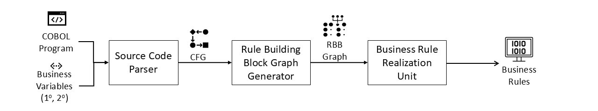

# A Tool for Identifying Business Rules in COBOL Programs

## Working of the Tool
The tool takes COBOL source code and the set of primary and secondary variables that are present in the source code as input. The source code parser generates the CFG from the source code. This CFG is passed to the Rule Building Block(RBB) graph generator which will form Atomic Units and Condition Units out of CFG while retaining the control flow information. The output of this graph generator is a RBB graph. This RBB graph is passed to the Business Rule Realisation (BRR) unit to extract business rules and activation graph.



Kindly refer to the [demo](https://youtu.be/adriX4q41PA) video for further explaination.


## Root Directory Contents

* __extractor.py__ : This file is the entry point of the tool
* __preprocessor.py__ : It contains functions for preprocessing the COBOL program.
* __businessVariables.txt__ : It is taken as one of the input to the tool, and it shoould have the details of primary and secondary variables in it.
* __requirements.txt__ : It contains the requirements to set up the environment to run the tool.
* __BenchmarkSuite__ : It contains the COBOL programs and the evaluation details of the tool.
* __ParsingUnit__ : It contains all the files contributing for generating CFG of the input COBOL file.
* __RBB__ : It contains all the files contributing for generating Rule Building Block graph of the input COBOL file.
* __BR Realisation__ : It contains the files responsible for fetching the rules from the RBB graph.
* __output__ : All the outputs are stored in this folder

## Execution of the tool:

1. Give information about the primary and secondary variables in the businessVariables.txt file in below mentioned format:
```text
<# of primary variables>
<!-- All primary variables one per line -->
<# of secondary variables>
<!-- All secondary variables one per line -->
```

2. Run extractor.py along with the input COBOL program file path:
```bash
python3 extractor.py input_cobol_file_path
```

3. Final output will be obtained in the [output](./output/) directory.

## Output
The tool provides the following outputs for each of the input COBOL program. It is under the folder named _COBOL\_\<input-program\>_. The folder contains the following:
* __CFG__ : It contains the pdf and the json for the Control flow graph of the input COBOL program under the name _CFG\_\<input-program\>.pdf_ and  _CFG\_\<input-program\>.json_ respectively. It also contains another .gv file which is generated by graphviz library.
* __CUs__ : It contains the Condition Units that are formed from the given CFG of the input program.
* __RBBs__ : It contains the pdf and the json for the Rule Building Block graph of the input COBOL program under the name _RBB\_\<input-program\>.pdf_ and  _RBB\_\<input-program\>.json_ respectively. It also contains another .gv file which is generated by graphviz library.
* __Rules__ : It contains the pdfs of the Rules identified by the tool for the given input COBOL program under the name _Rule\_i.pdf_ . It also contains another .gv file which is generated by graphviz library. Here i represent the ith rule out of total n rules that are extracted.
* __log-file__ : It contains information about the rules, that are triggered for the _when_ logic. If it is applicable in a given program.
* **BRR_\<input-program\>** : This is the activation flow graph of the input program given after realising the rules from it.
